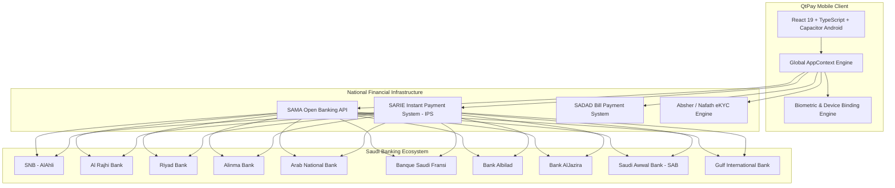
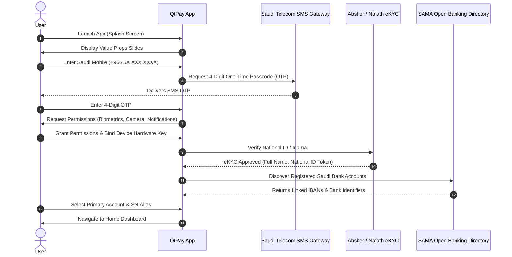
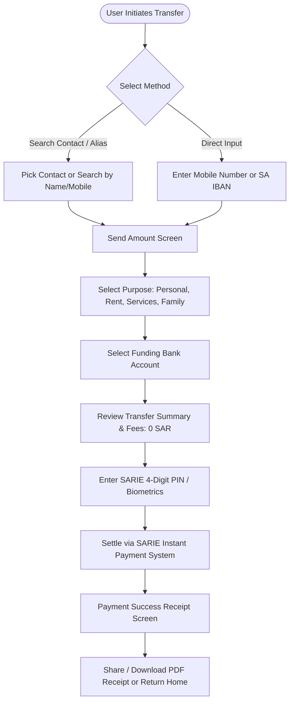
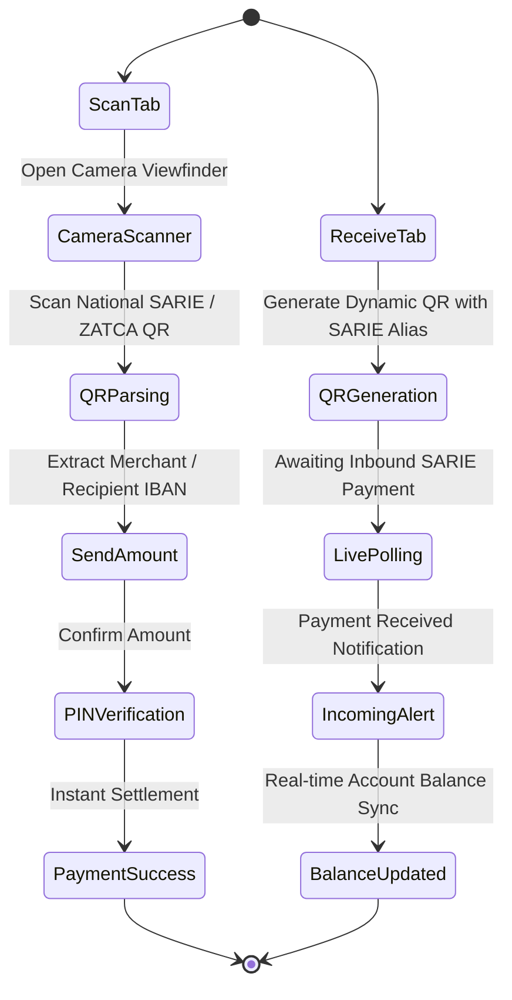

# QtPay (QPay) — Complete Application Specification & User Flows Report

---

## 1. Executive Summary & Platform Overview

**QtPay** (also known as **QPay**) is a premier, tier-1 Saudi Super Fintech and Mobile Banking Application built to unify payments, bank accounts, bill payments, and financial management across the Kingdom of Saudi Arabia.

Operating in full alignment with the **Saudi Central Bank (SAMA)** regulatory frameworks, QtPay integrates directly into national financial infrastructures:
1. **SARIE (Saudi Arabian Rial Interbank Express - IPS)** for instant 24/7/365 peer-to-peer (P2P) and merchant payments.
2. **SADAD Payment System** for bill discovery, utility aggregation, and single-click recurring settlements.
3. **SAMA Open Banking Framework** (AISP & PISP) for multi-bank balance aggregation, transaction sync, and account portability.
4. **Nafath / Absher eKYC** for digital identity verification, biometric authentication, and automated AML/CFT compliance.



---

## 2. Technical Architecture & Tech Stack

| Layer | Technology | Description |
| :--- | :--- | :--- |
| **Frontend Framework** | React 19 + TypeScript 5.9 | Reactive component tree, strict typing, zero mock errors. |
| **Mobile Runtime** | Capacitor 8 + Android Native | Native bridge for Android APK distribution and hardware APIs. |
| **Styling & Theming** | CSS Variables + Tailwind / Flexbox | Luxury dark aesthetic (`#080C14`), Brand Green (`#7FE87F`). |
| **Iconography** | Lucide Icons (`lucide-react`) | 100% SVG vectors, eliminating raw emojis. |
| **Localization** | Native Bilingual Engine | Seamless English & Arabic (العربية) with dynamic LTR/RTL layout mirroring. |
| **Build & Tooling** | Vite 8 + OpenJDK Corretto 21 + Gradle | High-speed hot module replacement and native APK packaging. |
| **Test Suite** | Playwright (Chromium) | 100% automated end-to-end user flow verification. |

---

## 3. End-to-End User Flows & Journeys

### Flow 1: User Onboarding, Authentication & KYC
This journey ensures verified, compliant user registration and Open Banking setup with zero friction.



#### Detailed Step Breakdown:
1. **Splash Screen (`SplashScreen.tsx`)**: Displays QtPay animated logo, SAMA regulated trust badges, and checks existing authentication tokens.
2. **Onboarding Slides (`OnboardingScreen.tsx`)**: 3 high-impact introductory slides highlighting Open Banking aggregation, instant SARIE transfers, and SADAD one-click bills.
3. **Mobile Login (`MobileNumberScreen.tsx`)**: Validates Saudi mobile numbers (+966 5X) with real-time formatting.
4. **SMS OTP Verification (`SmsOtpScreen.tsx`)**: 4-digit code input with clean individual focus fields and resend countdown timer.
5. **Permissions & Hardware Binding (`PermissionsScreen.tsx`)**: Binds the device secure enclave/KeyStore, configures push notifications and camera permissions for QR scanning.
6. **eKYC Verification (`OnboardingKycScreen.tsx`)**: Absher / Nafath verification ensuring SAMA regulatory compliance.
7. **Bank Account Linking (`OnboardingBankScreen.tsx`)**: Auto-discovers and connects verified Saudi banks via Open Banking APIs (SNB, Al Rajhi, Riyad, Alinma, SAB, etc.).

---

### Flow 2: Instant P2P Money Transfers (SARIE IPS)
Enables 24/7 real-time transfers across any Saudi bank using either mobile numbers, IBANs, or SARIE aliases.



#### Key Capabilities:
- **Instant Settlement**: Settles within seconds across all local banks.
- **Alias Resolution**: Automatically resolves `@alias`, mobile phone, or National ID to the recipient's tokenized IBAN.
- **Zero Hidden Fees**: Standard P2P transfers are free (0.00 SAR).
- **Digital Receipt**: Generates a tamper-proof digital receipt with SARIE reference ID, timestamp, and one-tap sharing.

---

### Flow 3: QR Code Payments (Scan to Pay & Receive)
Provides contactless, interoperable merchant checkout and peer-to-peer collection.



---

### Flow 4: SADAD Bill Payments & Discovery
Centralizes all utility, telecom, and government payments with real-time bill inquiry.

```mermaid
flowchart LR
    BillsHome[Bill Payments Home] --> BillerSelect[Select Biller: SEC, STC, NWC, MOI]
    BillerSelect --> EnterAccount[Enter Subscriber / Account No.]
    EnterAccount --> SADADInquiry[Real-Time SADAD Bill Inquiry]
    SADADInquiry --> BillDetails[Display Due Amount & Due Date]
    BillDetails --> PaymentAuth[Authorize Payment with PIN/Biometrics]
    PaymentAuth --> SADADSuccess[Instant Bill Settlement & SMS Confirmation]
```



#### Supported Biller Categories:
- **Electricity & Utilities**: Saudi Electricity Company (SEC), Marafiq.
- **Water Services**: National Water Company (NWC).
- **Telecom & Internet**: STC, Mobily, Zain, Salam, Red Bull Mobile.
- **Government Services**: Ministry of Interior (MOI), Absher, Traffic Violations, Passports (Jawazat).
- **Education & Municipalities**: Universities, Balady municipal fees.

---

### Flow 5: Spend Analysis & Visual Financial Intelligence
Provides deep spending analytics with interactive visualizations, budgeting, and export capabilities.

```mermaid
graph TD
    HeroCard[Total Spending & Integrated Budget Progress Bar]
    PeriodPills[Period Selector: Week | Month | Last Month | Year]
    PieChart[Category Distribution Donut Chart with Green Tints & Shades]
    BarGraph[Timeline Spending Bar Graph with Hover Tooltips]
    CategoryList[Itemized Category Breakdown with Transaction Counts]
    MerchantList[Top Saudi Merchants with Lucide Badges]
    InsightsBanner[Smart Financial Savings Insight]
    ExportBtn[Export Statement: PDF / CSV]

    PeriodPills --> HeroCard
    PeriodPills --> PieChart
    PeriodPills --> BarGraph
    PeriodPills --> CategoryList
    PeriodPills --> MerchantList
    HeroCard --> InsightsBanner
    HeroCard --> ExportBtn
```

#### Design System & Green Palette:
- **Shopping & Retail**: `#7FE87F` (Signature Brand Green)
- **Food & Dining**: `#4ADE80` (Vibrant Mint Emerald)
- **Bills & Utilities**: `#22C55E` (Classic Fintech Green)
- **Travel & Transport**: `#10B981` (Teal-Green Tone)
- **Transfers & Others**: `#A7F3D0` (Soft Pastel Mint Tint)
- **Health & Medical**: `#059669` (Rich Forest Jade Green)

---

### Flow 6: Multi-Bank Management & Open Banking
Gives users full visibility and control over all linked Saudi bank accounts in one place.

- **Bank Account Carousel & Grid**: Displays Al Rajhi, SNB, Riyad Bank, Alinma, and SAB cards with balances, account numbers, and status.
- **Set Primary Account**: Single tap sets the default account for incoming SARIE transfers and outgoing payments.
- **Link New Bank (`AddBankModal.tsx`)**: Integrates with SAMA Open Banking consent flow to link additional Saudi banks instantly.
- **Balance Refresh**: Real-time balance sync with individual bank core banking systems.

---

### Flow 7: Notifications, Request to Pay (R2P) & Dispute Resolution
- **Push Alerts**: Instant transaction notifications, bill due reminders, and security alerts.
- **Money Requests (R2P)**: Review incoming payment requests from friends or businesses with one-tap approve or decline.
- **Dispute Filing**: Submit transaction dispute tickets with 48-hour SAMA-mandated SLA resolution tracking.

---

## 4. Complete Screen & Modal Catalog

QtPay features **34 dedicated full screens** and **6 bottom-sheet modals**, ensuring comprehensive functional coverage:

### Screens Directory

| Screen ID | File Name | Route / Purpose |
| :--- | :--- | :--- |
| `SPLASH` | `SplashScreen.tsx` | App bootloader, token check, SAMA security branding. |
| `ONBOARDING` | `OnboardingScreen.tsx` | Value proposition slides and intro guide. |
| `MOBILE_NUMBER` | `MobileNumberScreen.tsx` | Saudi phone number entry (+966 5X). |
| `SMS_OTP` | `SmsOtpScreen.tsx` | 4-digit SMS OTP verification. |
| `PERMISSIONS` | `PermissionsScreen.tsx` | Device KeyStore binding, push & camera access. |
| `ONBOARDING_KYC` | `OnboardingKycScreen.tsx` | Absher / Nafath national digital identity verification. |
| `ONBOARDING_BANK` | `OnboardingBankScreen.tsx` | SAMA Open Banking multi-bank selection and linking. |
| `HOME` | `HomeScreen.tsx` | Main dashboard, quick actions, balances, and recent txns. |
| `PAY_ANYONE` | `PayAnyoneScreen.tsx` | Contact list, alias search, and recipient selection. |
| `SEND_AMOUNT` | `SendAmountScreen.tsx` | Amount entry, transfer purpose, source account selection. |
| `PAYMENT_SUCCESS` | `PaymentSuccessScreen.tsx` | Digital SARIE transaction receipt with shareable export. |
| `RECEIVE` | `ReceiveScreen.tsx` | QR code generation, alias display, inbound payment polling. |
| `SCAN` | `ScanScreen.tsx` | Real-time QR code camera scanner. |
| `ELECTRICITY` | `ElectricityScreen.tsx` | SADAD utility bill inquiry and settlement. |
| `SPEND_ANALYSIS` | `SpendAnalysisScreen.tsx` | Spending analytics, green pie chart, timeline bar graph. |
| `HISTORY` | `HistoryScreen.tsx` | Searchable, filterable ledger of all past transactions. |
| `BANK_ACCOUNTS` | `BankAccountsScreen.tsx` | Luxury multi-bank cards, primary account switch, balance sync. |
| `PAYMENT_METHODS` | `PaymentMethodsScreen.tsx` | Manage debit cards, credit cards, Apple Pay, and mada. |
| `UPI_SETTINGS` | `UPISettingsScreen.tsx` | SARIE alias management, IBAN mapping, and PIN reset. |
| `NOTIFICATIONS` | `NotificationsScreen.tsx` | Real-time transaction alerts, bill reminders, and R2P. |
| `MONEY_REQUESTS` | `MoneyRequestsScreen.tsx` | Manage inbound and outbound Request-to-Pay (R2P). |
| `REQUEST_MONEY` | `RequestMoneyScreen.tsx` | Create custom money requests with amount and note. |
| `MESSAGES` | `MessagesScreen.tsx` | In-app secure financial communications. |
| `ALL_SERVICES` | `AllServicesScreen.tsx` | Full catalog of financial and lifestyle services. |
| `FOOD` | `FoodScreen.tsx` | Food delivery and dining partner payments. |
| `SHOPPING` | `ShoppingScreen.tsx` | Retail and e-commerce partner checkout. |
| `TRAVEL` | `TravelScreen.tsx` | Flights, fuel, and transport payment integrations. |
| `REWARDS` | `RewardsScreen.tsx` | Cashback, partner discounts, and loyalty points. |
| `PROFILE` | `ProfileScreen.tsx` | User profile, tier status, KYC details, settings. |
| `SECURITY` | `SecurityScreen.tsx` | Biometrics toggle, PIN management, active devices. |
| `PRIVACY` | `PrivacyScreen.tsx` | SAMA data privacy policy and consent controls. |
| `HELP_SUPPORT` | `HelpSupportScreen.tsx` | 24/7 customer support, chatbot, and dispute tickets. |

---

### Bottom-Sheet Modals

| Modal | File Name | Functionality |
| :--- | :--- | :--- |
| **Add Bank Modal** | `AddBankModal.tsx` | Connect new Saudi bank via Open Banking consent. |
| **Pay Bill PIN Modal** | `PayBillPinModal.tsx` | Secure 4-digit PIN authorization for SADAD bills. |
| **Edit Profile Modal** | `EditProfileModal.tsx` | Update email, display alias, and profile preferences. |
| **App Links Modal** | `AppLinksModal.tsx` | Quick jump modal for fast feature discovery. |
| **Language Modal** | `LanguageModal.tsx` | Switch between English and Arabic (العربية) with instant RTL change. |
| **Logout Modal** | `LogoutModal.tsx` | Secure session termination with confirmation. |

---

## 5. Security, Compliance & Data Architecture

1. **SAMA & National Compliance**:
   - Built to comply with Saudi Central Bank (SAMA) Cyber Security Framework and Open Banking Standards.
   - Enforces 48-hour dispute resolution SLA tracking.
2. **Hardware KeyStore & Device Binding**:
   - Device binding locks session keys to the physical device's Secure Enclave / KeyStore.
3. **IBAN & Card Tokenization**:
   - Raw bank account details and card numbers are tokenized; zero plain-text financial credentials are stored locally.
4. **Biometric Authentication**:
   - Native integration with Face ID / Touch ID / Android BiometricPrompt for transaction approvals.
5. **Bilingual RTL/LTR Architecture**:
   - Full bidirectional mirror layout supporting Arabic font hierarchy and English typography seamlessly.

---

## 6. Build, Test & Deployment Verification

- **Automated Playwright Test Suite**: **8 / 8 test suites passing 100%** covering end-to-end user flows, modal lifecycles, and zero runtime errors across all 34 screens.
- **Android Native APK**: Fully compiled using OpenJDK 21 and Gradle, available at `qtpay-debug.apk`.
- **Git Version Control**: Clean commit history pushed to `main` on GitHub repository (`https://github.com/quantiratechnologies-gif/QPay.git`).
